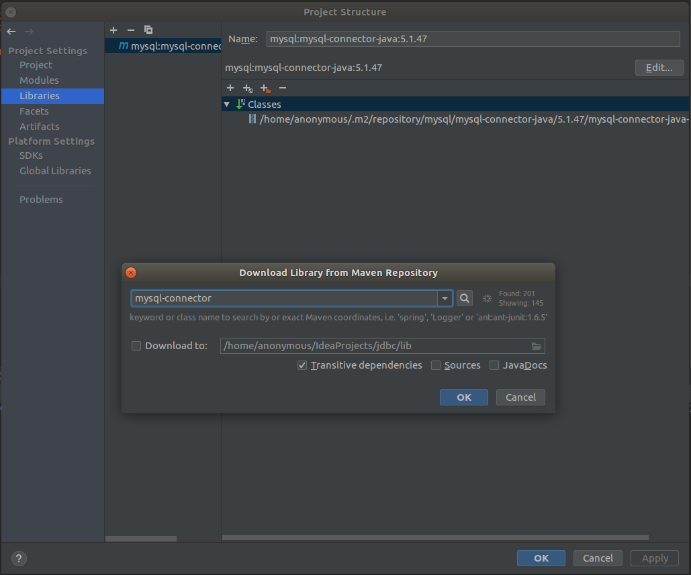
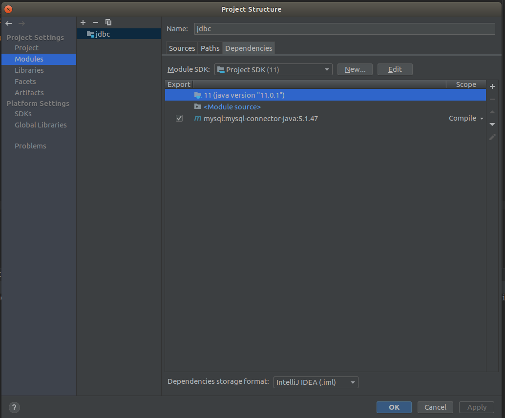
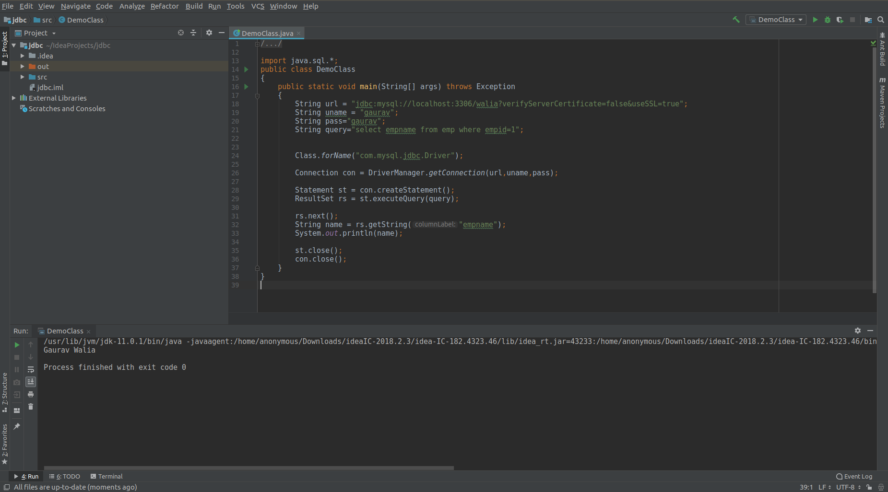

# USING JDBC (JAVA DATABASE CONNECTIVITY)

This repository contains the instructions for running **JDBC in UBUNTU** using **INTELLIJ IDEA IDE**.

## PREQUESTIES

* Java
* Mysql database
* SQL
* Using CLI (Terminal / CMD)
* Ubuntu

## CONTRIBUTION

Follow our Contributing [Guidelines]()

## INTELLIJ IDEA

Follow below steps to use mysql with java in ubuntu using **Mysql Connector**. For any doubts contact us at ```gauravwalia019@gmail.com```

* Firstly install mysql on ubuntu

```bash
sudo apt-get install mysql
sudo apt-get install mysql-server
sudo apt-get install mysql-client
```

* If u have installed mysql its cool then open terminal and run

```bash
sudo mysql -u root -p
```

Here -u is used for user and -p is for password

* Type the **sudo password** then it will ask **mysql password** by default its null so press enter.
* Then you will see mysql prompt like

```bash
mysql>
```

* Then type **show databases;** it will show

```bash
mysql> show databases;
+--------------------+
| Database           |
+--------------------+
| information_schema |
| mysql              |
| performance_schema |
| student            |
| sys                |
+--------------------+
6 rows in set (0.00 sec)
```

* type **create database walia** here walia is the database name you can select your name also

```bash
mysql> create database walia;
```

* again

```bash
mysql> show databases;
+--------------------+
| Database           |
+--------------------+
| information_schema |
| mysql              |
| performance_schema |
| student            |
| walia              |
| sys                |
+--------------------+
6 rows in set (0.00 sec)
```

* Now type **use walia;** or ```use <database name>```

```bash
mysql> use walia;
Reading table information for completion of table and column names
You can turn off this feature to get a quicker startup with -A

Database changed
```

* Now we will create table name emp using

```bash
mysql> create table emp(
empid int,
empname varchar(25)
);
```

* Now you can check the table creation using

```bash
mysql> describe emp;
+---------+-------------+------+-----+---------+-------+
| Field   | Type        | Null | Key | Default | Extra |
+---------+-------------+------+-----+---------+-------+
| empid   | int(11)     | YES  |     | NULL    |       |
| empname | varchar(25) | YES  |     | NULL    |       |
+---------+-------------+------+-----+---------+-------+
2 rows in set (0.00 sec)
```

* Then we will insert some data in it

```bash
mysql> insert into emp(empid,empname)
values(1,'Gaurav Walia');
```

* Now you will see the table has created

```bash
mysql> select * from emp;
+-------+--------------+
| empid | empname      |
+-------+--------------+
|     1 | Gaurav Walia |
+-------+--------------+
1 row in set (0.00 sec)
```

* Now its time to create user here

```bash
# SYNTAX: CREATE USER 'username'@'host' IDENTIFIED BY 'password';

mysql> CREATE USER "gaurav"@"localhost" IDENTIFIED BY "gaurav";
```

* Granting privileges to user i.e gaurav

```bash
mysql> GRANT ALL PRIVILEGES ON * TO "gaurav"@"localhost";
mysql> FLUSH PRIVILEGES;
mysql> SHOW GRANTS FOR 'gaurav'@'localhost';
```

* Then exit the mysql server using

```bash
mysql> exit
Bye
```

* Then it time for checking the user

```bash
# SYNTAX: sudo mysql -u username -p
sudo mysql -u gaurav -p
```

* type

```bash
mysql> show  databases;
+--------------------+
| Database           |
+--------------------+
| information_schema |
| walia              |
+--------------------+
2 rows in set (0.00 sec)
```

* Now type below commands for checking data

```bash
mysql> use walia;
Reading table information for completion of table and column names
You can turn off this feature to get a quicker startup with -A

Database changed

mysql> show tables;
+-----------------+
| Tables_in_walia |
+-----------------+
| emp             |
+-----------------+
1 row in set (0.00 sec)

mysql> SELECT empid,empname FROM emp;
+-------+--------------+
| empid | empname      |
+-------+--------------+
|     1 | Gaurav Walia |
+-------+--------------+
1 row in set (0.00 sec)
```

* Now will run a query i.e

```bash
mysql> SELECT empname FROM emp where empid=1;
+--------------+
| empname      |
+--------------+
| Gaurav Walia |
+--------------+
1 row in set (0.00 sec)
```

* NOW ITS TIME FOR USING INTELLIJ to run the above query using java
* Create a new project in intellij
* Then u will see .idea folder
* Right click on the folder name and create a new class name DemoClass.java
* Enter the below code

```java
import java.sql.*;
public class DemoClass
{
    public static void main(String[] args) throws Exception
    {
        String url = "jdbc:mysql://localhost:3306/walia?verifyServerCertificate=false&useSSL=true";
        String uname = "gaurav";
        String pass="gaurav";
        String query="select empname from emp where empid=1";


        Class.forName("com.mysql.jdbc.Driver");

        Connection con = DriverManager.getConnection(url,uname,pass);

        Statement st = con.createStatement();
        ResultSet rs = st.executeQuery(query);

        rs.next();
        String name = rs.getString("empname");
        System.out.println(name);

        st.close();
        con.close();
    }
}
```

* Now we will change and add java database connector in intellij
* First click on File on top-left side and select project structure
* A prompt will open then select libraries and click on + and select maven and find mysql-connector 5.1.47



* Now select apply and then click ok
* Then make sure that mysql-connector is selected in modules



* Now all the setting are done
* Its time to run the java file and see the result will be the result of query you have finded on the table above

